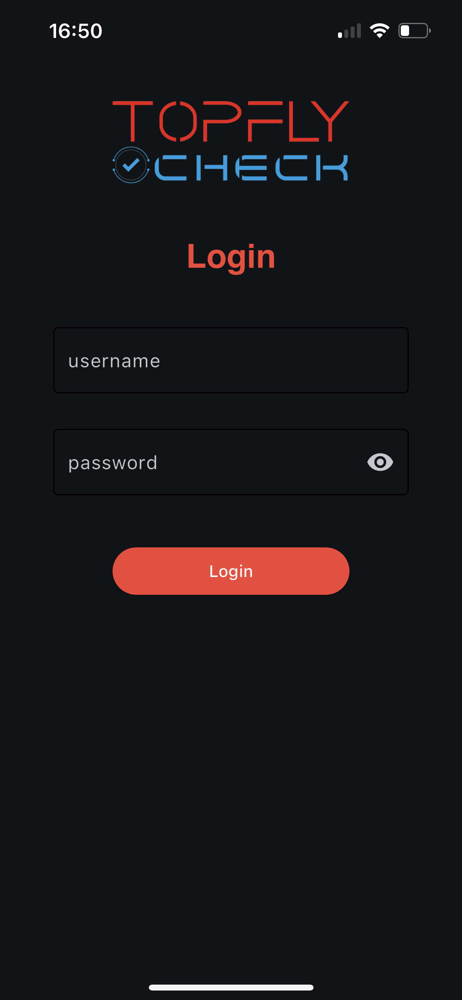
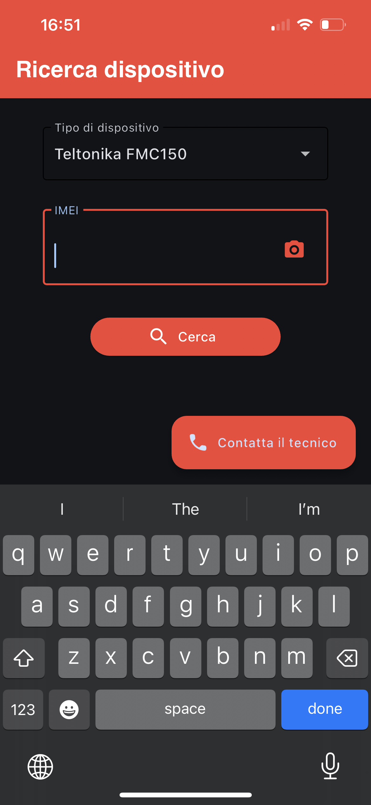
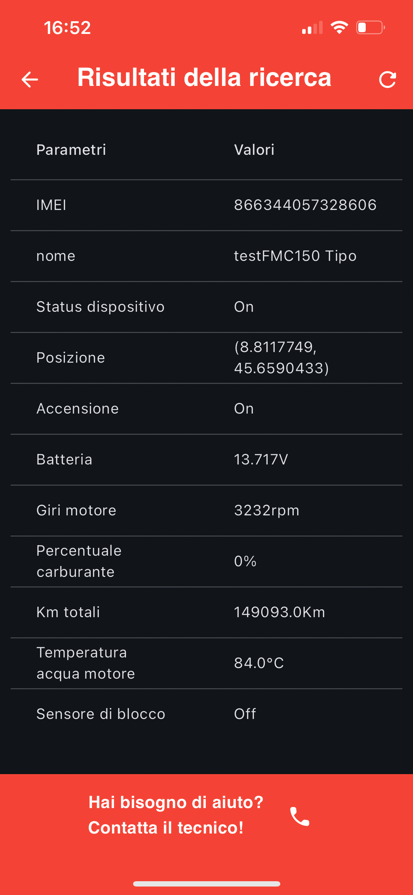
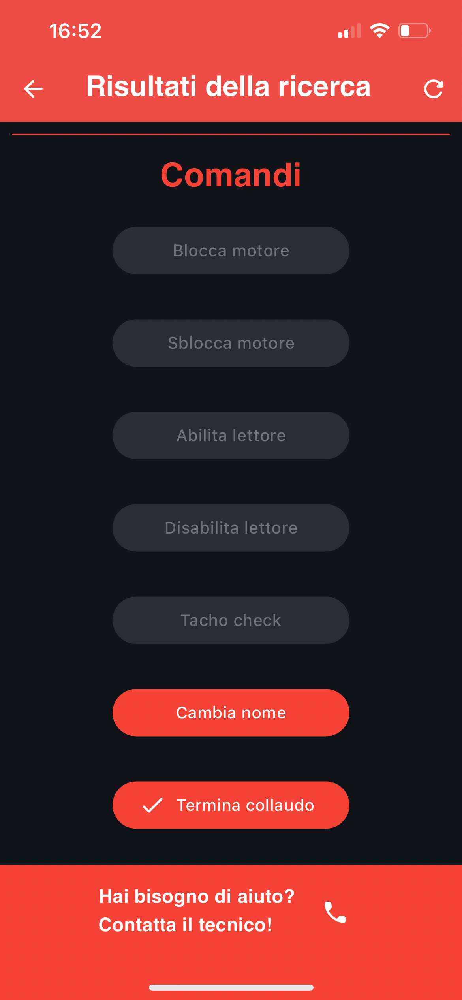
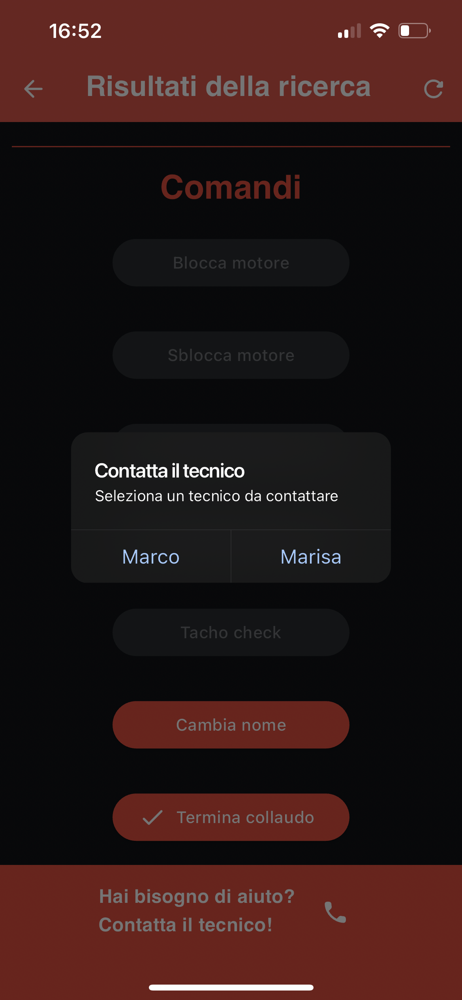

# T Check

Progetto python per la prova finale del corso di ingegneria gestionale L8 al Politecnico di Torino.

L'applicazione 'T Check' è stata appositamente sviluppata su richiesta della Topfly s.r.l. (https://topfly.pro),
azienda che si occupa di sviluppo hardware e software per il monitoraggio, controllo e gestione di veicoli da remoto.
T Check, attualmente in fase di test da parte del personale dell'azienda, verrà utilizzata come supporto 
per l'installazione e il collaudo di nuovi dispositivi, le funzionalità a disposizione includono:
1) Login con username e password

2) Ricerca del dispositivo tramite codice identificativo univoco

3) Ricerca del dispositivo tramite scansione di immagine contenente un codice QR dalla galleria (in fase di ottimizzazione)
4) Display dei dati ottenuti dalla ricerca 

5) Esecuzione di comandi relativi al tipo di dispositivo (cambio del nome, blocco e sblocco del motore, tacho check, abilitazione del lettore)

6) Possibilità di contattare un tecnico in caso di problemi specifici effettuando la telefonata direttamente dall'app

7) Inoltro di una email all'azienda contenente tutti i dati del collaudo

L'applicazione è stata sviluppata in python utilizzando principalmente l'api fornita dalla piattaforma di gestione dei dati
per effettuare le richieste ed eseguire i comandi, oltre al modulo requests e altri moduli specifici per l'inoltro
di email, chiamate e altre richieste http/https ad esempio l'inoltro del file contenente il codice QR ad un servizio
per la decodifica. L'interfaccia grafica è stata realizzata utilizzando la libreria flet che mette a disposizione 
diverse soluzioni per la realizzazione di pagine semplici e intuitive oltre a diversi metodi per le richieste http, 
file picker, autenticazione e lo stesso comando di build per la creazione dei bundle di installazione apk e ipa 
su dispositivi mobili. La struttura è stata sviluppata sulla base dei pattern MVC e DAO per
separare le responsabilità di diverse parti dell'applicazione e per migliorare la modularità e la manutenibilità del codice.

Le informazioni specifiche di ogni file e di ogni metodo sono scritte direttamente nel codice sotto forma di commenti, 
i file di codice eseguibile si trovano nelle cartelle Connection, Model, UI, il punto di accesso all'applicazione è invece
il file main.py. Le altre cartelle del progetto contengono librerie esterne necessarie per il funzionamento dell'applicazione
e altre risorse come immagini e icone.
